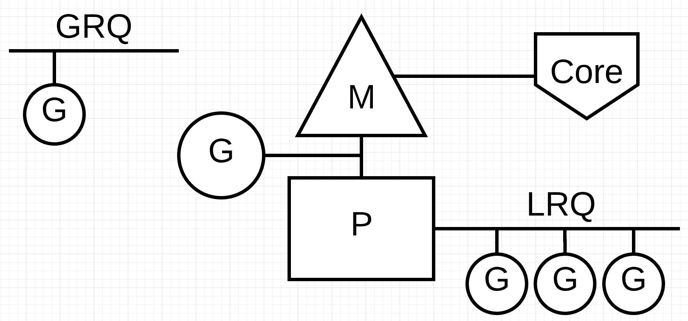

### How the scheduler works.

### Concurrent Software Design

Concurrency means undefined “out of order” execution. Taking a set of instructions that would otherwise be executed in sequence and finding a way to execute them out of order and still produce the same result. For the problem in front of you, it has to be obvious that out of order execution would add value.

When I say value, I mean add enough of a performance gain for the complexity cost. Depending on your problem, out of order execution may not be possible or even make sense.

It’s also important to understand that [concurrency is not the same as parallelism](https://blog.golang.org/concurrency-is-not-parallelism). Parallelism means executing two or more instructions at the same time. This is a different concept from concurrency. Parallelism is only possible when you have at least 2 operating system (OS) and hardware threads available to you and you have at least 2 Goroutines, each executing instructions independently on each OS/hardware thread.

Both you and the runtime have a responsibility of managing the concurrency of the application. You are responsible for managing these three things when writing concurrent software:

**Design Philosophy:**

* The application must startup and shutdown with integrity.
    * Know how and when every goroutine you create terminates.
    * All goroutines you create should terminate before main returns.
    * Applications should be capable of shutting down on demand, even under load, in a controlled way.
        * You want to stop accepting new requests and finish the requests you have (load shedding).
* Identify and monitor critical points of back pressure that can exist inside your application.
    * Channels, mutexes and atomic functions can create back pressure when goroutines are required to wait.
    * A little back pressure is good, it means there is a good balance of concerns.
    * A lot of back pressure is bad, it means things are imbalanced.
    * Back pressure that is imbalanced will cause:
        * Failures inside the software and across the entire platform.
        * Your application to collapse, implode or freeze.
    * Measuring back pressure is a way to measure the health of the application.
* Rate limit to prevent overwhelming back pressure inside your application.
    * Every system has a breaking point, you must know what it is for your application.
    * Applications should reject new requests as early as possible once they are overloaded.
        * Don’t take in more work than you can reasonably work on at a time.
        * Push back when you are at critical mass. Create your own external back pressure.
    * Use an external system for rate limiting when it is reasonable and practical.
* Use timeouts to release the back pressure inside your application.
    * No request or task is allowed to take forever.
    * Identify how long users are willing to wait.
    * Higher-level calls should tell lower-level calls how long they have to run.
    * At the top level, the user should decide how long they are willing to wait.
    * Use the `Context` package.
        * Functions that users wait for should take a `Context`.
            * These functions should select on <-ctx.Done() when they would otherwise block indefinitely.
        * Set a timeout on a `Context` only when you have good reason to expect that a function's execution has a real time limit.
        * Allow the upstream caller to decide when the `Context` should be canceled.
        * Cancel a `Context` whenever the user abandons or explicitly aborts a call.
* Architect applications to:
    * Identify problems when they are happening.
    * Stop the bleeding.
    * Return the system back to a normal state.

Index of the three part series:
1) [Scheduling In Go : Part I - OS Scheduler](https://www.ardanlabs.com/blog/2018/08/scheduling-in-go-part1.html)
2) [Scheduling In Go : Part II - Go Scheduler](https://www.ardanlabs.com/blog/2018/08/scheduling-in-go-part2.html)
3) [Scheduling In Go : Part III - Concurrency](https://www.ardanlabs.com/blog/2018/12/scheduling-in-go-part3.html)