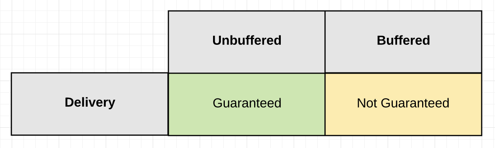
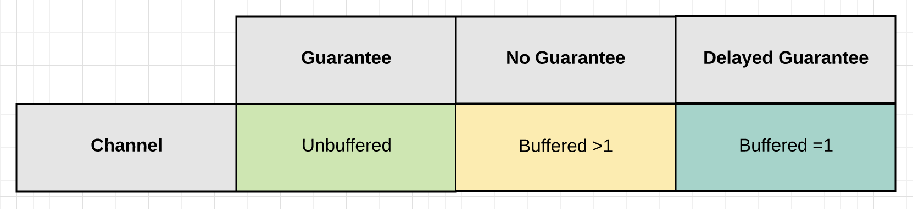
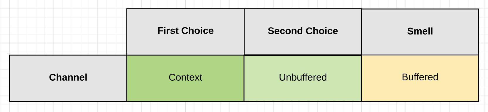
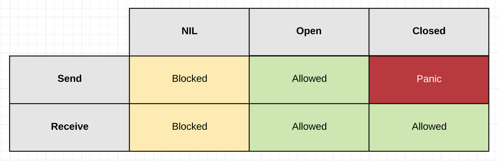

## Channels
Channels allow goroutines to communicate with each other through the use of signaling semantics. Channels accomplish this signaling through the use of sending/receiving data or by identifying state changes on individual channels. Don't architect software with the idea of channels being a queue, focus on signaling and the semantics that simplify the orchestration required.

## Design Guidelines

* Learn about the [design guidelines](../../#channel-design) for channels.

## Diagrams

### Guarantee Of Delivery

The `Guarantee Of Delivery` is based on one question: “Do I need a guarantee that the signal sent by a particular goroutine has been received?”

### Signaling With Or Without Data

When you are going to signal `with` data, there are three channel configuration options you can choose depending on the type of `guarantee` you need.

Signaling without data serves the main purpose of cancellation. It allows one goroutine to signal another goroutine to cancel what they are doing and move on. Cancellation can be implemented using both `unbuffered` and `buffered` channels.

### State

The behavior of a channel is directly influenced by its current `State`. The state of a channel can be `nil`, `open` or `closed`.

