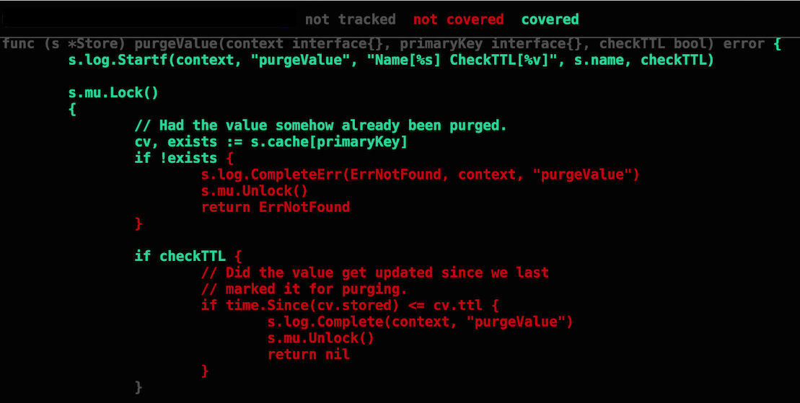

## Coverage

Making sure your tests cover as much of your code as possible is critical. Go's testing tool allows you to create a profile for the code that is executed during all the tests and see a visual of what is and is not covered.

	go test -coverprofile cover.out
	go tool cover -html=cover.out

___
All material is licensed under the [Apache License Version 2.0, January 2004](http://www.apache.org/licenses/LICENSE-2.0).